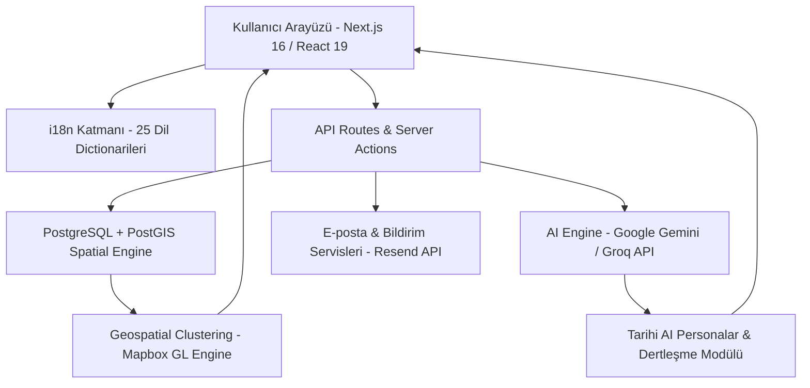

  

    
  

  # The Regret Wall (Pişmanlık Duvarı)

  **Duygusal Yükleri Özgürleştirme ve İyileşme Platformu**

  *Kimliğinizi gizli tutarak içinde kalanları paylaşın, rahatlayın ve yalnız olmadığınızı hissedin.*

   

  
  
  
  
  

---

## Problem ve Çözüm Özeti

* **Problem**: İnsanlar hayatları boyunca ifade edemedikleri, içlerinde biriken derin pişmanlıkları ve duygusal yükleri yalnız başlarına taşımakta; bu durum zihinsel bir izolasyon duygusu yaratmaktadır.
* **Çözüm**: **The Regret Wall**, insanların tamamen anonim bir şekilde pişmanlıklarını dijital evrene bırakabilecekleri, dünya haritası üzerinde küresel duygusal ağı keşfedebilecekleri ve tarihi AI kişilikleri ile dertleşebilecekleri 25 dilde hizmet veren aktif ve küresel bir web platformudur.

---

## Teknoloji ve Beceri Kategorileri

### Frontend ve Arayüz

  
  
  
  
  
  
  
  
  
  

### Backend ve Veritabanı

  
  
  
  
  
  
  
  

### Yapay Zeka ve ML Entegrasyonları

  
  
  
  
  

### Dağıtım ve DevOps (Deployment)

  
  
  
  
  
  

---

## Öne Çıkan Özellikler

1. **Küresel Kozmos ve Etkileşimli Harita**:
   - Mapbox GL ve PostgreSQL PostGIS mekansal sorguları kullanılarak geliştirilen interaktif küresel harita.
   - Farklı coğrafyalardaki pişmanlık düğümlerinin yoğunluğuna göre dinamik kümeleme (clustering) ve ışıldama efektleri.

2. **Tarihi AI Kişilikler ile Empati Sohbetleri**:
   - Gelişmiş LLM (Google Gemini / Groq) entegrasyonu ile Nikola Tesla, Robert Oppenheimer, Kurt Cobain, Sylvia Plath ve Marie Curie gibi tarihi figürlerin yapay zeka modelleriyle dertleşme alanı.

3. **İyileşme Yolculuğu (Healing Journey)**:
   - Kullanıcıların pişmanlıklarını kabullenmelerine, duygusal farkındalık kazanmalarına ve öz-şefkat geliştirmelerine yardımcı olan adım adım rehberlik sistemi.

4. **Dönüşüm Hikayeleri (Transformation Stories)**:
   - Topluluk tarafından paylaşılan, pişmanlıkların nasıl birer olgunlaşma ve ders çıkarma hikayesine dönüştüğünü gösteren ilham verici deneyim alanı.

5. **25 Dilde Tam Yerelleştirme (i18n Engine)**:
   - İngilizce, Türkçe, İspanyolca, Fransızca, Almanca, Rusça, Ukraynaca, Arapça, Hintçe, Japonca, Korece, Portekizce, Azerbaycan Türkçesi, Çince, Endonezce, İtalyanca, Felemenkçe, Tagalogca, Vietnamca, Lehçe, İsveççe, Norveççe, Tayca, İbranice ve Malayca dillerinde eksiksiz destek.

---

## Ekran Görüntüleri ve Platform Galerisi

  <table width="100%">
    <tr>
      <td width="50%" align="center">
        <b>Main Page & Global Feed</b>  
        
      </td>
      <td width="50%" align="center">
        <b>Interactive World Map</b>  
        
      </td>
    </tr>
    <tr>
      <td width="50%" align="center">
        <b>Historical AI Persona Chat</b>  
        
      </td>
      <td width="50%" align="center">
        <b>Healing Journey & Blog</b>  
        
      </td>
    </tr>
  </table>

---

## Sistem Mimarisi (Architecture)

Aşağıdaki şema, platformdaki veri akışını, kullanıcı etkileşimini ve altyapı bileşenlerini göstermektedir:

---

## 🌐 Platforma Erişim

**The Regret Wall**, canlı ve aktif olarak yayında olan kapalı kaynaklı bağımsız bir web uygulamasıdır. Platformu deneyimlemek ve incelemek için doğrudan resmi adresi ziyaret edebilirsiniz:

👉 **[theregretwall.com](https://www.theregretwall.com)**

---

  The Regret Wall - Tüm Hakları Saklıdır. Private Product Showcase.

